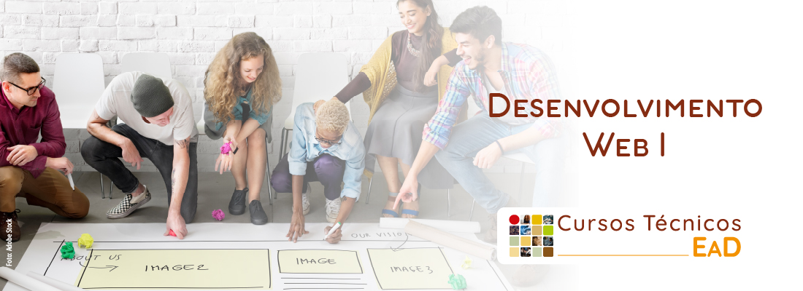

<h1 align="center">
  Desenvolvimento Web 1
</h1>

## Roteiro

<ul>
  <li>
    <a href="#sobre">Sobre</a>
  </li>
  <li>
    <a href="#unidade-1--introdução-a-web-e-tópicos-de-design">Unidade 1 - Introdução a Web e Tópicos de Design</a>
  </li>
  <li>
    <a href="#unidade-2--construção-do-design-de-páginas-web-com-figma">Unidade 2 - Construção de Páginas Web com Figma</a>
  </li>
  <li>
    <a href="#unidade-3---introdução-ao-html-e-github">Unidade 3 - Introdução ao HTML e GitHub</a>
  </li>
  <li>
    <a href="#unidade-4--sintaxe-do-html">Unidade 4 - Sintaxe do HTML</a>
  </li>
  <li>
    <a href="#unidade-5--layouts-html-e-introdução-ao-css">Unidade 5 - Layouts HTML e Introdução ao CSS</a>
  </li>
</ul>

## Sobre

  Nesta disciplina, iniciaremos nossa jornada no mundo do desenvolvimento web. Conheceremos o ambiente da Internet, veremos noções de design e aplicaremos esses conceitos na prática utilizando HTML e CSS.

## Unidade 1 – Introdução a Web e Tópicos de Design

  Nesta unidade, vamos fazer uma introdução às tecnologias Web e descrever os principais conceitos aplicados ao Design de Interface de Usuário.

**Conteúdo:**

- Introdução à Internet e World Wide Web (WWW):
  - O Ambiente Web: Histórico da Internet e Web
  - Conceitos Básicos da Arquitetura Cliente-Servidor
  - Serviços da Internet
- Design de Interface de Usuário:
  - Princípios de IHC
  - Princípios de Diagramação
  - Princípios e elementos da UX
  - Requisitos de usabilidade

## Unidade 2 – Construção do Design de Páginas Web com Figma

  Nesta unidade, vamos finalizar os conceitos de design e aprender a construir o layout de uma página web com o Figma.

**Conteúdo:**

- Design de Interface de Usuário
  - Acessibilidade na Web
  - Padrões de interação e navegação na Web
  - Layout e composição
  - Avaliação de usabilidade
- Construção de Layout com Figma
  - Página Inicial
  - Página Interna
  - Formulários

## Unidade 3 - Introdução ao HTML e GitHub

  Nesta unidade, vamos fazer uma introdução a páginas web estáticas e principais linguagens: HTML, CSS e Javascript. Aprenderemos a sintaxe básica do HTML e seus principais elementos. Também faremos uma breve introdução a sistemas de controle de versões e como armazenar e publicar nossas páginas web estáticas no Github.

**Conteúdo:**

- Introdução ao HTML:
  - Sintaxe básica do HTML
  - Elementos de Texto, Imagens e Links
  - Prática das tags em ferramenta online de edição
  - Tags semânticas
  - Instalação de uma ambiente de Desenvolvimento Local
- Uso do Github:
  - Criar repositório
  - Enviar os arquivos
  - Ligar Github pages

## Unidade 4 – Sintaxe do HTML

  Nesta unidade, vamos continuar o estudo da linguagem HTML, discutindo as melhores práticas e a criação de formulários e tabelas.

**Conteúdo:**

- Sintaxe da Linguagem HTML:
  - Boas práticas
  - Formulários
  - Tabelas

## Unidade 5 – Layouts HTML e Introdução ao CSS

  Nesta unidade vamos aprender a construção de layouts HTML com Iframe e fazer uma introdução à sintaxe básica do CSS e seus principais elementos.

**Conteúdo:**

- Boas práticas de construção de layout com HTML
- Introdução ao CSS
  - Sintaxe básica
  - Incorporação ao HTML (inline, interno, externo)
  - Cores e Background
  - Tipografia
  - Borda
  - Margem
  - Padding

## Unidade 6 – Definição do Design de Páginas Web com CSS

  Nesta unidade vamos continuar aprendendo as tags de estilo do CSS.

**Conteúdo:**

- Posicionamento
- Flex
- Grid
