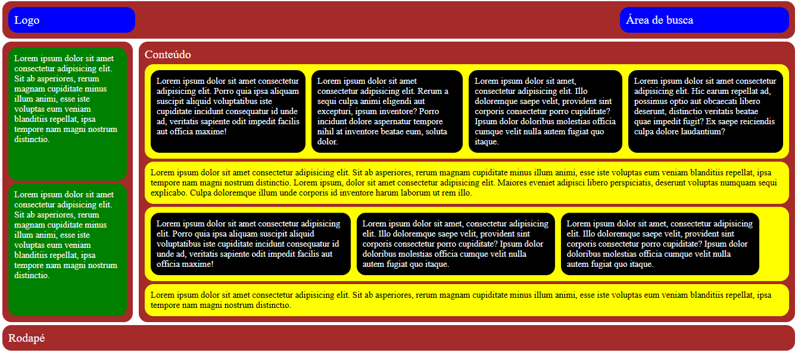

  <strong>
    Instituto Federal de Educação, Ciência e Tecnologia do Ceará (IFCE)  
    Campus Baturité  
    Curso Técnico Subsequente em Informática para Internet
  </strong>

  <strong>
    Atividade Extra da Unidade 6 da Disciplina de Desenvolvimento Web 1
  </strong>

  <strong>
    Baturité-CE  
    2024
  </strong>

  <strong>
    Identificação do Aluno
  </strong>

**Nome:** Pedro Henrique Marinho Euzebio
**Professor(a):** Cintia Reis de Oliveira
**Curso:** Técnico Subsequente em Informática para Internet
**Turma:** 2024.1

**Caros(as) alunos(as),**

**desenvolvam o Layout abaixo usando as técnicas de Grid e Flex estudados na aula.**

**A atividade extra será utilizada como pontuação, caso o aluno precise ao final da disciplina.**

